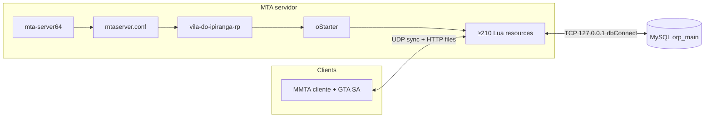

# Architecture overview — Vale do Ipiranga RP / MTA:SA

**Versão:** 1.0 · **Atualização:** 2026-05-02

---

## Executive summary

O servidor é um processo Linux **`mta-server64`** que carrega o gamemode **modular**. O recurso raíz **`vila-do-ipiranga-rp`** inicia apenas o orquestrador **`oStarter`**, que por sua vez dá **`start`** a ~**210** pacotes ordenados (~**200** explícitos + dinâmicos **`oFKSkins_*`**). A persistência reside em **MySQL** (`orp_main`). Não há “monólito”: o comportamento emerge de centenas de ficheiros Lua que se ligam por **exports**, **events** e **element data**.

Caminhos concretos (instalação típica):

- Binário MTA e `mods/deathmatch/mtaserver.conf`
- Pacote gamemode: `mods/deathmatch/resources/vila-do-ipiranga-rp/` (symlinks individuais em `mods/deathmatch/resources/<nome>`)

---

## System context diagram



---

## Layered architecture

| Camada | Componentes |
|--------|----------------|
| **Host** | Kernel, rede, systemd/screen (operações; ver `infra/server-setup.md`) |
| **MTA runtime** | Motor sync, ACL, downloads HTTP internos, anticheats do motor (`disableac`, `enablesd`) |
| **Bootstrap gamemode** | `vila-do-ipiranga-rp/meta.xml` + `server.lua` → `oStarter` |
| **Core services** | `oMysql`, `oCore`, `oChat`, `oAnticheat*`, loaders, shaders master |
| **Domain** | Conta/inventário/veículos/banco/dashboard/jobs/maps — centenas de recursos |
| **Presentation (client)** | Scripts `client/` por recurso, DX UI, shaders, replace model |

---

## Dependency philosophy (effective, not nominal)

Um grafo nominal “limpo” **não existe no código**: dependências são **implícitas** (ordem de `oStarter` + convenções como `exports.oMysql`). O caminho **crítico** operacional para um jogador autenticado:

```
oMysql (DB up) → oCore (whitelist/IDs/globals) → oAccount (+ peças de UI paralelas)
→ oAdmin (permissões) → resto (inventory, vehicles, factions, …)
```

**Risco:** recursos iniciados **antes** de `oAdmin` podem logar falhas pontuais de `exports`; após todos estarem UP, comportamento estabiliza (comportamento conhecido; ver `infra/acl-e-recursos.md`).

---

## Trust boundaries

| Frontier | Regra |
|----------|--------|
| **Cliente → servidor** | `triggerServerEvent`: **nunca** confiar nos argumentos como identidade — usar sempre `source`, validação de jogador |
| **Element data para clientes** | Dados marcados sincronização default podem vazar dados de sessão — revisão contínua (TD-ARCH-002) |
| **ACL / arquivo** | `acl.xml`: editar apenas serviço offline; grupo Admin + `aclSave()` |
| **MySQL credentials** | Ficheiros do recurso `oMysql`; `database_credentials_protection` limita leakage via `fileOpen` |

---

## Related documents

| Document | Purpose |
|---------|---------|
| [resumo-tecnico-servidor.md](resumo-tecnico-servidor.md) | Ciclo vida processo / rede / starters |
| [resource-map.md](resource-map.md) | Ordem starter, contagens export, automatização dossiers |
| **[generated/resource-dependency-graph.json](generated/resource-dependency-graph.json)** | **Deps reais inferidas**: consumo `exports.*`, `call(getResourceFromName,…)`, `getResourceFromName`, eventos, cruzamento com `oStarter` |
| **[generated/architecture-risk-report.json](generated/architecture-risk-report.json)** · [**architecture-risk-report.md**](generated/architecture-risk-report.md) | **Risk intel v3.1** — governança encerrada nesta fase: além de snapshots + tendência + heatmap + smells + ownership + roadmap: **acoplamento aferente/eferente** (`resource_metrics` + `coupling_analysis`), **detector de regressão** (`regression_analysis` vs snapshot anterior; cascata por recurso apenas com baseline **analyzer ≥ 3.1.0**) e **scorecard executivo** (`executive_scorecard`). Fluxo: `resource_dependency_scan.py --write` → `architecture_risk_analyzer.py --write`. |
| **[generated/resource-dependency-report.md](generated/resource-dependency-report.md)** | Versão Markdown legível para gestão técnica (pares `exports` mútuos, fan‑in/out) |
| [event-flow.md](event-flow.md) | Padrões evento/sync |
| [database-architecture.md](database-architecture.md) | Tabelas schema |
| [deployment-guide.md](deployment-guide.md) | Checklists operação |
