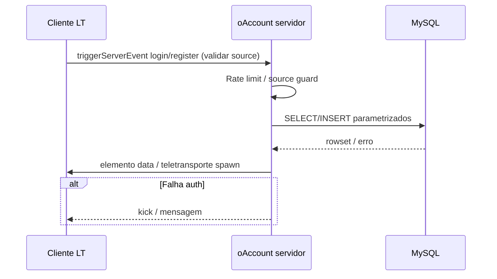

# Event flow patterns — servidor ↔ cliente

**Atualização:** 2026-05-02

---

## 1. Principais superfícies de mensagem MTA Lua

| Mecanismo | Direção típica | Notas |
|-----------|-----------------|-------|
| `triggerServerEvent` | Client → Server | **`source`** = jogador emissor válido quando `propagate` default — nunca usar player passado só como argumento sem validação |
| `triggerClientEvent` | Server → Client | Pode falhar pacotes massivos broadcast; sempre filtar destinos |
| `addEventHandler` sobre `resourceRoot/root` | Ambos | Ordem registada importa dentro do mesmo recurso |
| **`exports.res:fn`** | Server↔Server (mesmo VM) ou cross-resource | Falha duramente se recurso STOP |
| **`setElementData` / sincronização** | Server → Replicação client opcional conforme flags | Vetor leak se dados sensíveis sem `"private"` (quando disponível nas builds) |

---

## 2. Fluxo alto nível — autenticação (referência mental)

Este diagrama conceptual **não** substitui leitura de `oAccount/*`; serve para onboarding.



**Invariantes segurança (project rules):**

- Handler clienteados: primeira linha lógica = validar jogador contra `source`.
- Nunca executar poder admin baseado apenas em argumentos enviados pelo cliente.

---

## 3. Broadcast vs targeted events

Boas práticas desta base:

| Padrão | Quando usar |
|--------|-------------|
| `triggerClientEvent(root, …)` sparingly | Poucos filtros só se payload pequeno e necessidade global UI |
| `triggerClientEvent(targetPlayer, …)` | Maioria das atualizações pessoais (inventário, HUD, dialogs) |
| `triggerLatentClientEvent` | Transferências grandes (quando projeto adoptar conscientemente — verificar uso existente antes de novo) |

Abuso de broadcasts aumenta uso CPU rede e permite timing side-channels observáveis.

---

## 4. ElementData como canal implícito

Muitos módulos leem **`getElementData(player, "user:loggedin")`** e afins antes de aplicar RP.

**Limite:** Confiança apenas no valor **servidor‑autoritativo**. Client pode tentar spoof local em builds modificadas — servidor deve re-validar sempre que há efeitos econômicos.

Ver dívida **TD-ARCH-002** (element data modelo sessão).

---

## 5. Detecção de superfície (ferramenta)

Gerar primeira passagem brute:

```bash
cd mods/deathmatch/resources/vila-do-ipiranga-rp
rg 'trigger(Server|Client)Event\s*\(|addEvent\s*\(' --glob '*.lua' \
  | wc -l
```

Interpretar resultado como **aproximação** de hotspots de auditoria manual.

---

## 6. Recursos relacionados

- Templates análise: [CLAUDE.md](CLAUDE.md)
- Histórico hardening conta: [security/security-log.md](security/security-log.md)
