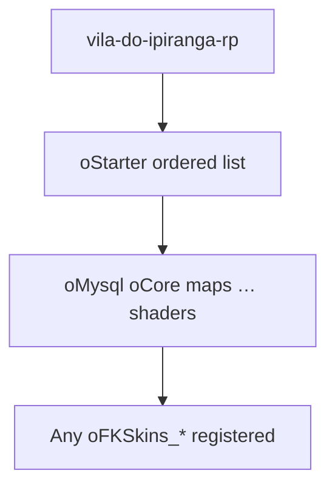

# Resource map — load order & dependency surface

**Atualização:** 2026-05-02

---

## Naming & counts

| Contagem | Significado |
|----------|-------------|
| **~400** | Pastas no pacote que contêm `meta.xml` (inventário *código-fonte*) |
| **~210** | Recursos efectivamente iniciados pelo **`oStarter`** + quaisquer `oFKSkins_*` registados quando o servidor arranca |

**Contrato oficial de arranque:** `[Core]/oStarter/starter_manifest.lua` (**`ORP_ORIGINAL_RP_START_ORDER`**) + `server.lua` (perfil + skins `oFKSkins_*`). Perfil típico: **`original_rp`** (lista Original Roleplay sanitizada: sem duplicados `oNewPD`/`oBillboards`; sem recursos inexistentes `oPlant`/`oPlaneCrash`/`gtavbahama`; ver `infra/acl-e-recursos.md`). Alternativa QA: **`streamlined`** (`ORP_STREAMLINED_EXCLUDE` no manifest).

**Importante:** A lista oficial ORP também inclui nome **sem** prefixo **`o`** (`npc_hlc`, `trailerDepoBuild`, `cigy`, packs `dude_*`, …) — cortar apenas por prefixo **`o*`** partiria mapas/gameplay indispensáveis.

**Catálogo legível PT-BR (tabela recurso × função resumida):** [catalogo-originalrp-ipiranga.md](catalogo-originalrp-ipiranga.md).

---

## Bootstrap chain

1. **`mtaserver.conf`** `<resource startup="1" src="vila-do-ipiranga-rp"/>`
2. **`vila-do-ipiranga-rp/server.lua`** — `startResource(getResourceFromName("oStarter"))`
3. **`oStarter`** — loop ordenado `startResource` (+ append `oFKSkins_*`)



**Quirk:** mesmo final do `oStarter`: `restartResource` retardado (~10 s) para inventário/outros; recursos nomeados mas inexistentes produzem apenas warnings.

---

## Exports declarados em `meta.xml`

Apenas **89** pacotes declararam explicitamente `<export>` (total ~**568** funções nomeadas na meta). Lista agregada: [generated/meta-export-stats.md](generated/meta-export-stats.md).

**Interpretação:**

- Alta densidade export: `dynamic_light*` (shader), **`oInventory`**, **`oCore`**, **`oDashboard`**.
- Consumo (**`exports.otherResource:fn()`**) **não** aparece só na meta — exige análise estática/grep Lua (ver próxima secção).

## Dependency scanner (`exports.` consumidas, eventos, `oStarter`)

| Artefacto | Conteúdo |
|-----------|----------|
| [generated/resource-dependency-graph.json](generated/resource-dependency-graph.json) | Grafo + listas `{ exports, events, references, undeclared_dependencies, resources, … }` |
| [generated/resource-dependency-report.md](generated/resource-dependency-report.md) | Sumário executivo: top consumers/providers, **pares mútuos** `exports` A↔B, flags ordem arranque / externos |
| [tooling/resource_dependency_scan.py](tooling/resource_dependency_scan.py) | Fonte única Python 3 (`--root` opcional para outra árvore `resources/`; `--write` gera ambos artefactos) |

```bash
cd mods/deathmatch/resources/vila-do-ipiranga-rp
python3 docs/tooling/resource_dependency_scan.py --write
```

**Notas:** heuristic de eventos inter-recurso igual strings de nome; grafo truncado nos JSON se >8000 aristas únicas `(emitter, listener, event)` — ver campo `event_inter_resource_heuristic_deduped_total`.

## Regenerar estatísticas de export

```bash
cd mods/deathmatch/resources/vila-do-ipiranga-rp
python3 docs/tooling/export_meta_summary.py | head -80
```

---

## Padrão recomendado: “analysis dossier por recurso”

Para cumprir o standard do **CLAUDE operational brief** (“cada recurso: propósito, deps, exports, events, DB…”):

Use o template em [CLAUDE.md](CLAUDE.md) secção **Análise por recurso (template Markdown)** quando documentar trabalho manual pontual.

**Automatização (roadmap técnico):**

1. Extrair lista de recurso desde `meta.xml`.
2. `grep -R "\\bexports\\.[a-zA-Z0-9_-]+"` em cada `.lua` → consumidas.
3. Parso `meta.xml` → exportadas declaradas (já há script).
4. `grep addEvent/addEventHandler/trigger(Server|Client)Event` → matriz incompleta (falsos positivos razoáveis).
5. `grep db(Query|Exec|Poll)`/`getDBConnection` → uso BD.

Construir relatório combinado (**sem** garantir falsos negativos em Lua dinâmico).

---

## Operational dependency graph (minimal critical path)

Não há detector de ciclos no repositório. Conhecimento empírico da equipa:

- **Breaking `oMysql` ou alterar signatures `getDBConnection`** derruba praticamente tudo downstream.
- **Renomear export** em `oCore`, `oAccount`, `oAdmin`, `oInventory`, `oVehicle` sem compat layer — outage em massa.

---

## Circular / ordering hazards

| Zona | Problema |
|------|-----------|
| `oStarter` ordem | Recursos tardios assumem dados globais já populados pelo core |
| `exports` antes de READY | Logs “call to non-running resource” durante boot |
| Nomes FK duplicados / mapas OLD | Possível recurso iniciado manualmente pelo admin em paralelo ao starter esperado |
