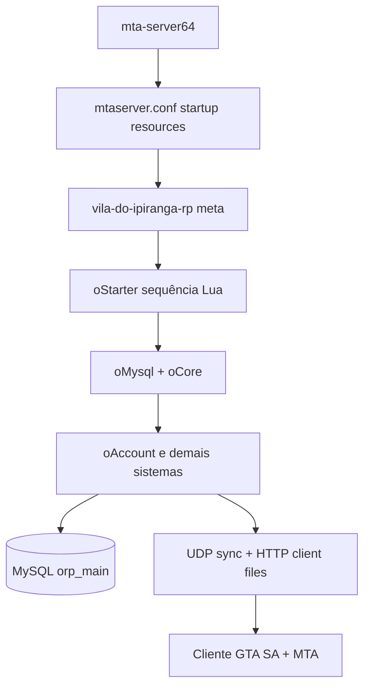

# Resumo técnico — como funciona o servidor (MTA:SA / Vale do Ipiranga RP)

**Data:** 2026-05-02  
**Âmbito:** Processo Linux, binário MTA, `mtaserver.conf`, gamemode em `vila-do-ipiranga-rp/`, MySQL e recursos Lua. Este texto descreve **como as peças se encaixam**; o inventário linha-a-linha de recursos e mapas está em `catalogo-originalrp-ipiranga.md`.

---

## 1. O que isto é, em uma frase

É um **servidor dedicado Multi Theft Auto: San Andreas** (processo `mta-server64`) que corre **Lua** lado servidor e lado cliente. O mundo de jogo é o mapa vanilla do GTA: SA, **sobreposto** por objectos/definições de mapa (`.map` dentro de recursos), ** shaders**, e **substituições de modelos** (DFF/TXD) onde configurado. Persistência económica, contas e inventário via **MySQL** (`orp_main`). A base é o gamemode **Original Roleplay** (MIT); esta cópia foi adaptada sob o nome **Vale do Ipiranga RP**.

---

## 2. Hierarquia de ficheiros no disco

```
multitheftauto_linux_x64/
├── mta-server64                 # Binário principal
├── mods/deathmatch/
│   ├── mtaserver.conf           # Config global: portas, recursos startup, ASE, ACL path…
│   ├── acl.xml                  # ACL MTA — editar apenas com servidor PARADO (ver infra)
│   ├── logs/server.log          # Diário servidor
│   └── resources/
│       ├── admin, mapmanager…   # Recursos incluídos no MTA
│       ├── vila-do-ipiranga-rp -> … (ou cópia)  # recurso “gamemode” raíz
│       └── oMysql, oCore, …     # Tipicamente symlinks por recurso → pastas dentro de:
│                                   vila-do-ipiranga-rp/
```

Os **~400** `meta.xml` do gamemode vivem em `mods/deathmatch/resources/vila-do-ipiranga-rp/`. O MTA **só os vê** se existirem entradas em `resources/` (normalmente **symlinks individuais** por recurso — ver `infra/acl-e-recursos.md` para conflitos com recursos default como `ajax`/`glue`).

---

## 3. Arranque: do processo até ao jogo utilizável

### 3.1 Processo MTA

1. `--config mods/deathmatch/mtaserver.conf` (valor usual ao lançar a partir da raiz instalada).
2. O servidor abre UDP na **`<serverport>`** (por defeito exemplo de configuração: **22003**), TCP HTTP interno em **`<httpport>`** (ex.: **22005**) para **download de ficheiros** dos recursos para o cliente (`<file src="...">` nos `meta.xml`).
3. `ASE` opcional (**serverport + 123**) para listagem em browsers.

Trechos relevantes já presentes na config típica: `servername`, `maxplayers`, `minclientversion`, lista `<resource startup="1">`.

### 3.2 Recursos default + gamemode

No `mtaserver.conf`, além dos recursos do pacote (`admin`, `mapmanager`, `spawnmanager`, etc.), aparece algo como:

- `<resource src="vila-do-ipiranga-rp" startup="1" … />`

Esse recurso **não** contém a lógica massiva do RP: só o **primeiro nível do bootstrap**:

```lua
-- vila-do-ipiranga-rp/server.lua — resumo
onResourceStart → getResourceFromName("oStarter") → startResource(starter)
```

Se `oStarter` não estiver symlinkado/registado, o servidor fica sem carregar o resto do gamemode.

### 3.3 Orquestração `oStarter`

`[Core]/oStarter/server.lua` mantém um array ordenado Lua e faz `startResource` **em sequência** para ~200 nomes fixos mais **dinamicamente** todos os recursos cujo nome casa com **`^oFKSkins_`**.

Efeitos práticos:

- **Ordem importa**: recursos mais à frente na lista presumem dependências já iniciadas (há chamadas temporáneas a exports antes de todos estarem estáveis — comportamento histórico documentado em `infra/acl-e-recursos.md`).
- **Duplicados** na lista (`oNewPD`, `oBillboards`): segundo `startResource` pode falhar com “already running”; trata-se como benigno.
- **Timer (~10 s)**: faz `restartResource` de alguns pacotes (`oInventory`, `oSpeedo`, …); entradas inexistentes (`oPlant`, …) apenas geram erro de script.

Ou seja: **o comportamento nominal do servidor = `vila-do-ipiranga-rp` → `oStarter` → centenas de scripts Lua + asset packs**.

---

## 4. Fluxo típico de um jogador

1. **Ligação de rede**: cliente ↔ UDP sync + HTTP transferência de scripts e ficheiros do recurso.
2. **`oMysql` já correu**: há `dbConnection` servidor (singleton) exposto por **export** (`getDBConnection`). Sem MySQL válido o arranque de `oMysql` falha e o servidor perde persistência central.
3. **`oCore`**: whitelist, FPS, IDs exibidos, integrações auxiliares; variáveis globais de marca (ex.: `global.lua`).
4. **Autenticação / personagem** (`oAccount` e relacionados): após login bem-sucedido, o servidor preenche **element data** coerente (`user:*`, `char:*`, …) usada por todo o gamemode.
5. **Recursos satélite** (inventory, veículos, chat, trabalhos…) reagem a `onPlayerJoin`, `user:loggedin`, eventos custom e **exports**.

Modelo conceptual de permissões (tal como está desenhado no código — ver `architecture.md`):

- Serial/developer em **`adminserials`** (BD) pode mapear para **developer** (`aclLogin`).
- **`accounts.admin`** e funções **`oAdmin`** (nível admin, duty) controlam comandos de moderação.

---

## 5. Persistência MySQL

| Aspeto | Detalhe |
|--------|---------|
| **Implementação** | `[Core]/oMysql/server.lua` — `dbConnect("mysql", "dbname=…;host=…", user, password, …)` no `onResourceStart`. |
| **API interna** | `exports.oMysql:getDBConnection()` e `getLogsDBConnection()` (podem repartir a mesma base). |
| **Schema** | `orp_main`; referência e migrações em `orp_main.sql` / `sql/migrations/` (conforme repositório). |
| **Produção** | Host `127.0.0.1` TCP é o padrão deste projeto; particularidades Ubuntu 24 / **libssl1.1** para `dbconmy.so` documentadas em **`docs/infra/server-setup.md`**. |

**Credenciais** ficam atualmente nos scripts (`oMysql`); `database_credentials_protection=1` no `mtaserver.conf` só **endurece o acesso aos ficheiros** do recurso — não substitui rotação de passwords ou secreto fora do VCS.

---

## 6. Como os recursos comunicam entre si

Não existe um monólito RP: há **malha de Lua micro-serviços MTA**:

| Mecanismo | Uso típico |
|-----------|-------------|
| **`exports`** | Chamada síncroma servidor↔servidor Lua: `exports.oMysql:getDBConnection()`, `exports.oAdmin:isPlayerDeveloper(p)`, … **Contratos estáveis**: renomear quebra outros recursos. |
| **`addEventHandler` / `trigger*Event`** | Fluxo servidor→cliente, cliente→servidor ou entre recursos via `resourceRoot`/elementos globais `root`. Alguns projetos aplicam salts de nome (`*_OriginalRP`) ou camadas tipo `triggerHack`/anti-hook. |
| **`elementData`** | Estado distribuído no `player`/veículos; convenções `user:*`, `char:*` documentadas em `.cursor/context/architecture.md`. |
| **`setTimer`, `mysql`-callback** | Fluxos assíncronos padrão Lua MTA |

---

## 7. Cliente: o que o jogador baixa e executa

- **Scripts** `client.lua`/`shared.lua` marcados nos `meta.xml` com downloads HTTP do servidor ou mirror externo (`httpdownloadurl` se configurado).
- **DX/UI**: HUD, radar, inventário gráfico, dashboards — desenho com primitives MTA DX + frequentemente fontes **`oFont`**.
- **Shaders**: HLSL compilados lado cliente quando o recurso shaders arranca (`oShader_*`).
- **Modelos/Texturas**: `engineReplaceModel` / `engineImportTXD` em scripts client onde aplicável (paintjobs DDS, tuning DFF menores, eventos específicos).

O anti-cheat do **motor MTA** (AC/SD configuráveis em `mtaserver.conf`) é diferente das camadas **`oAnticheat`/`oAnticheat2`** do gamemode.

---

## 8. Conteúdo de mundo (.map / model loader)

Os ficheiros **`.map`** não são níveis GTA separados: são dados usados pelo **editor de mapa MTA** por recurso (objectos criados/removidos, posições). Carregamento depende do **recurso pai** estar `start`; muitos estão apenas em `[Maps]/`/`[Faction]/`/….

Listagem única dos **123** `.map`: ver **`catalogo-originalrp-ipiranga.md`** § Mapas.

---

## 9. Organização conceptual dos recursos (o “que tem lá dentro”)

- **`[Core]/`**: infraestrutura (mysql, starter, chat, anticheat, starter, loaders, alguns shaders de base).
- **Raíz do pacote**: `oAccount`, `oVehicle`, `oInventory`, `oDashboard`, trabalhos dispersos ou em `[Jobs]/`.
- **`[Maps]/`, `[Carlos]/`, `[paul]/`, `[theMark]/`, `[Dexter]/`, `[Interface]/`, `[Shaders]/`, `[FKSKINS]/`**: contribuições modulares (mapas, veículos, eventos, UI extra, shaders, pacotes skins facção).
- **`[Old]/`**: legado — tratado como arquivo, não recomendado como base nova.

Inventário de **nome + função** do que o `oStarter` arranca: tabela grande em **`catalogo-originalrp-ipiranga.md`**.

---

## 10. ACL e segurança operacional (MTA + gamemode)

- **`mods/deathmatch/acl.xml`**: grupos (Admin, Moderator…), objetos (`resource.admin`, …). **`aclSave()`** pode sobrescrever o ficheiro ao parar recursos admin — política descrita em **`docs/infra/acl-e-recursos.md`** (servidor **parado** para editar).
- **`auth_serial_groups`**: típico `Admin` no `mtaserver.conf` para exigência de serial autorizado em contas ACL protegidas.
- **Vulnerabilidades históricas** da base OriginalRP e prioridades de refactor: **`prioritized-resource-list.md`**, **`technical-debt-report.md`**, **`security/security-log.md`**.

Isto não é auditoria atualizada automática — é o mapa onde procurar risco.

---

## 11. Logs, diagnóstico e ciclo DevOps rudimentar

| Fonte | Conteúdo |
|-------|-----------|
| `mods/deathmatch/logs/server.log` | Lifecycle recursos, erros Lua servidor, falhas HTTP |
| `outputServerLog` custom | Mensagens tipo `[Vila RP]`, `[STARTER]:` |
| `oLogs` recurso | persistência opcional estruturada em BD segundo implementação atual |

Restart típico (exemplo infra): screen + `./mta-server64` conforme **`server-setup.md`**.

---

## 12. Diagrama mental (compacto)



---

## 13. Documentos relacionados neste repositório

| Documento | Quando ler |
|-------------|-----------|
| `catalogo-originalrp-ipiranga.md` | Lista de recursos do `oStarter`, mapas, mods veículos |
| `relatorio-tecnico.md` | Histórico de modernização + métricas do repo |
| `architecture/initial-assessment.md` | Riscos/dívida inicial detalhada |
| `infra/server-setup.md` | VPS, MySQL, libssl, comandos lifecycle |
| `infra/acl-e-recursos.md` | ACL, symlinks, quirks `oStarter` |
| `README.md` na raíz do pacote RP | Contrato exports / arranque lógico resumido |

---

## 14. Limitações conscientes deste resumo

- **Não** documenta comando-a-comando RP nem payloads SQL específicos.
- Versões exactas de ficheiros mudam por commit; sempre validar **`oStarter/server.lua`** e **`meta.xml`** do recurso em alteração.
- Contagem de recursos/table pode diferir ± entre branches; use `find … -name meta.xml | wc -l` para número actual.
